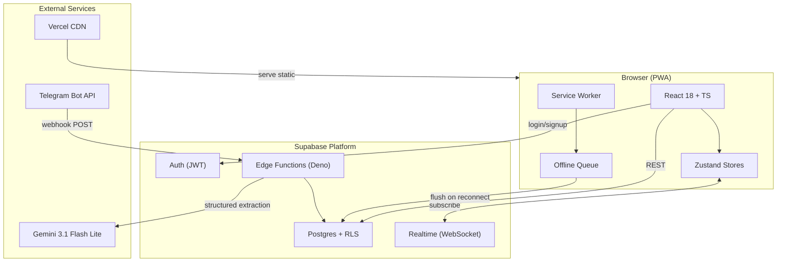
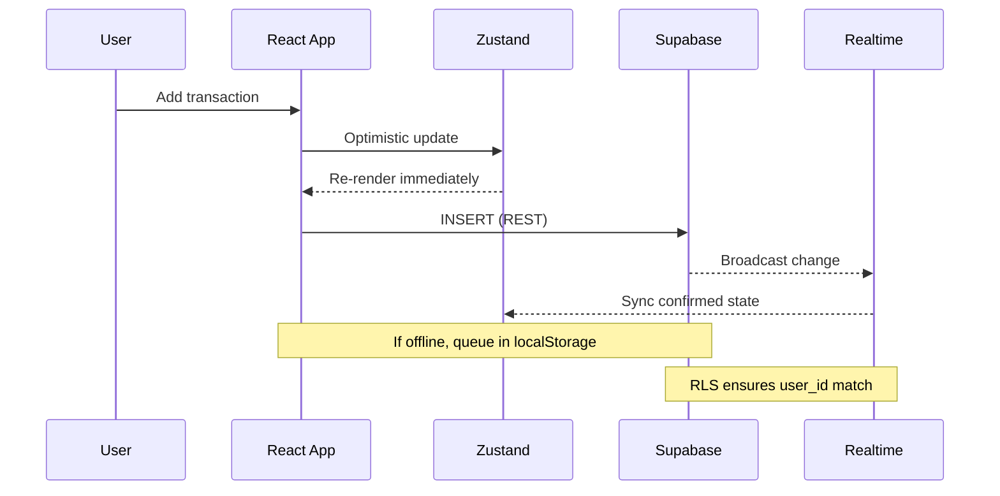
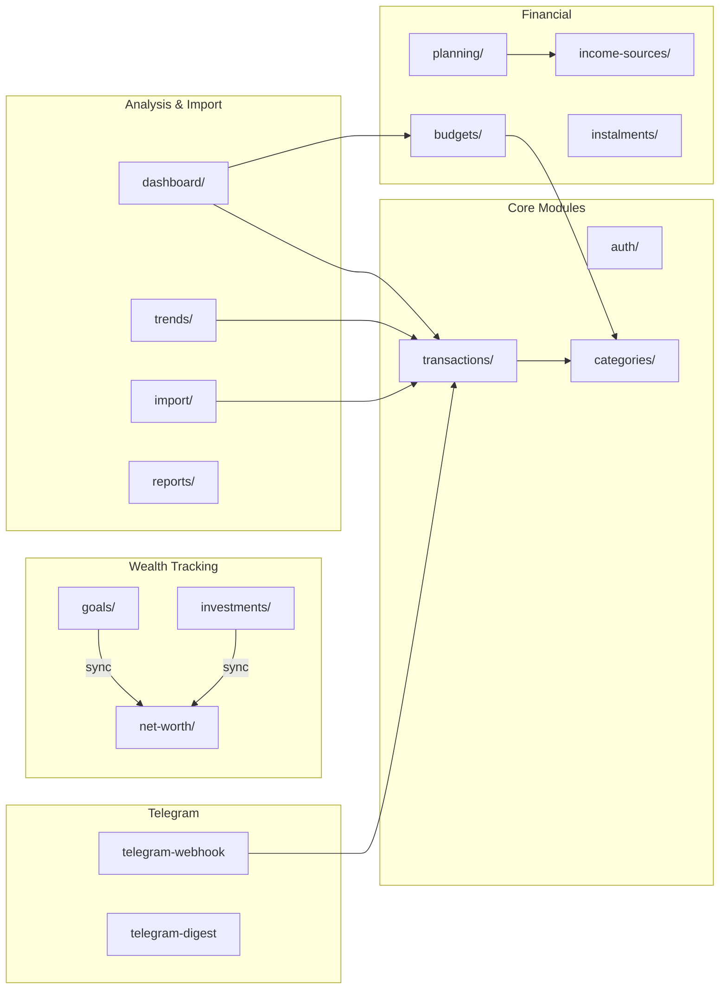

# Fluxo

Personal finance PWA for a single Portuguese user. Log transactions in under 10 seconds, set monthly budget limits, track instalment plans, manage investments, and review spending trends — all synced in real time via Supabase.

## Tech Stack

- **Framework:** React 18 + TypeScript (strict mode)
- **Build:** Vite
- **Styling:** TailwindCSS + design tokens (`src/styles/tokens.css`)
- **Routing:** React Router v7
- **State:** Zustand
- **Backend:** Supabase (Postgres, Auth, Realtime)
- **Charts:** Recharts
- **PDF:** @react-pdf/renderer (client-side report generation)
- **CSV:** papaparse (bank statement import)
- **PWA:** vite-plugin-pwa (Workbox GenerateSW)
- **Dates:** date-fns with pt-PT locale
- **Package manager:** pnpm

## Prerequisites

### On your PC (development)

| Requirement | How to install |
|-------------|---------------|
| **Node.js** ≥ 18 | [nodejs.org](https://nodejs.org) or `nvm install 18` |
| **pnpm** ≥ 8 | `npm install -g pnpm` |
| **Git** | [git-scm.com](https://git-scm.com) |
| A **Supabase** project | [supabase.com](https://supabase.com) — create a free project in eu-central-1 (Frankfurt) or eu-west-1 |
| A modern **browser** | Chrome, Firefox, or Edge (for PWA support) |

### On your phone (mobile use)

| Platform | What you need |
|----------|---------------|
| **Android** | Chrome → open your deployed URL → tap "Add to Home Screen" from the ⋮ menu |
| **iOS** | Safari → open your deployed URL → tap Share (↑) → "Add to Home Screen" |

> **Note:** The app must be served over **HTTPS** for the PWA to work on mobile. Use Vercel, Netlify, or Supabase Hosting for free deployment. Locally, `pnpm dev` serves on `http://localhost:5173` which works fine for development but won't install as a PWA on phones.

## Setup

1. Clone the repository:
```bash
git clone https://github.com/migueltvv00/miva-financer.git
cd miva-financer
```

2. Create `.env.local` with your Supabase credentials:
```env
VITE_SUPABASE_URL=https://your-project.supabase.co
VITE_SUPABASE_ANON_KEY=your-anon-key-here
```

3. Install dependencies and start:
```bash
pnpm install
pnpm dev
```

4. Open `http://localhost:5173` in your browser. Create an account on first visit — default categories are seeded automatically.

## Deployment (so you can use it on your phone)

### Vercel (recommended, free)
```bash
pnpm build
npx vercel --prod
```
Set `VITE_SUPABASE_URL` and `VITE_SUPABASE_ANON_KEY` as environment variables in the Vercel dashboard.

### Manual
```bash
pnpm build
# Upload the `dist/` folder to any static hosting with HTTPS
```

After deploying, open the URL on your phone and add it to your home screen for the full app experience.

## Scripts

| Command | Description |
|---------|-------------|
| `pnpm dev` | Start dev server (http://localhost:5173) |
| `pnpm build` | Production build to `dist/` |
| `pnpm preview` | Preview production build locally |
| `pnpm lint` | ESLint |
| `pnpm type-check` | TypeScript type checking |
| `pnpm test:e2e` | Run Playwright E2E tests (requires `sudo npx playwright install-deps chromium`) |

## Environment Variables

| Variable | Description | Safe to commit? |
|----------|-------------|-----------------|
| `VITE_SUPABASE_URL` | Supabase project URL | No |
| `VITE_SUPABASE_ANON_KEY` | Supabase anonymous/publishable key | No |

## Project Structure

```
src/
  components/    # Reusable UI (BottomNav, Sidebar, NumPad, etc.)
  features/      # Feature modules
    auth/        # Login, signup
    transactions/ # Entry, list, edit
    budgets/     # Budget limits
    dashboard/   # Monthly summary, PDF export
    categories/  # Category management
    settings/    # App settings
    goals/       # Savings goals
    trends/      # Spending trend analysis
    planning/    # Monthly budget planning
    income-sources/ # Income source management
    net-worth/   # Net worth snapshot
    investments/ # Investment portfolio tracking
    import/      # Bank statement CSV import
    instalments/ # Instalment/split tracking
    reports/     # PDF report generation
  hooks/         # Shared hooks (useAuth, useOnlineStatus, useCategorySuggestion)
  lib/           # Supabase client, utils, constants
  store/         # Zustand stores (one per domain)
  styles/        # Design tokens, global CSS
  types/         # Shared TypeScript types
```

## Features

### v1.0 — Core
- ✅ Auth (login/signup with Supabase Auth)
- ✅ Category management (CRUD, emoji/color, reorder)
- ✅ Quick transaction entry (NumPad, category grid, offline queue)
- ✅ Transaction list (grouped by date, filters, swipe delete, edit)
- ✅ Budget limits (per-category monthly, copy from last month)
- ✅ Monthly summary dashboard (charts, progress bars, realtime sync)
- ✅ Recurring transactions (weekly/monthly/yearly, auto-creation)

### v1.1 — Planning & Goals
- ✅ Income sources (salary/freelance/other, IRS Categoria B widget)
- ✅ Monthly budget planning (plan vs actual comparison)
- ✅ Savings goals (progress tracking, add funds, completion celebration)

### v1.2 — Intelligence & Insights
- ✅ Spending trends (3m/6m averages, sparklines, insight labels)
- ✅ Monthly PDF report (income, expenses, budget variance, IRS disclaimer)
- ✅ Smart category suggestions (note-based frequency analysis)
- ✅ Net worth snapshot (manual assets/liabilities, line chart)

### v1.3 — Power Features
- ✅ Bank statement CSV import (CGD, BPI, Millennium BCP, Novo Banco)
- ✅ Instalment tracking (auto-creates N monthly transactions)
- ✅ Investment portfolio (accounts, snapshots, gain/loss, sync to net worth)

### v1.4 — Telegram Bot
- ✅ Natural-language transaction entry via Telegram (`/add`, `/gasto`, `/receita`)
- ✅ PIN-based authentication linking Telegram ↔ Supabase account
- ✅ Daily financial digest (`/digest`)
- ✅ Balance and status check (`/saldo`)

### v1.5 — Audit & PIN Fix
- ✅ Telegram PIN authentication hardening
- ✅ Audit logging improvements

### v1.6 — Payslip Import (PDF)
- ✅ Upload Portuguese payslip PDFs → automatic extraction via Gemini 3.1 Flash Lite
- ✅ Creates income + deduction transactions (IRS, SS, Outros)
- ✅ Salary evolution chart (last 6 months)
- ✅ YTD IRS/SS totals

### v1.7 — Payslip Improvements & Quota
- ✅ Gemini quota panel (requests remaining today)
- ✅ Payslip extraction refinements
- ✅ Payment method tracking (cartão refeição, multibanco, mbway, etc.)
- ✅ Telegram `/recibo` command to view last payslip

### v1.8 — Session Stability & Planning
- ✅ Auth session recovery button
- ✅ Payslip collapsible raw preview (gross, net, deductions breakdown)

### v1.9 — Auth & Payslip Budget
- ✅ AuthContext singleton — eliminates session loss on navigation
- ✅ Payslip net salary auto-fills `monthly_plans.expected_income_cents` (visible in Planning)
- ✅ JSON Plan B — import payslip data via JSON file when PDF extraction fails
- ✅ Net worth registry — auto-sync from goals & investments
- ✅ Meal card budget — separate tracking from payslip allowance
- ✅ Architecture overhaul — lazy loading, code splitting, stale-while-revalidate caching
- ✅ Transaction search — filter by note, category, or amount
- ✅ Payment method analysis — bar chart breakdown on dashboard
- ✅ Telegram /editar and /apagar — edit/delete transactions via bot

## Architecture

### System Overview (Mermaid)



### Data Flow (Mermaid)



### Feature Module Map (Mermaid)



### Core Architecture Decisions

| Decision | Choice | Why |
|----------|--------|-----|
| State management | Zustand | Minimal boilerplate, works outside React, stale-while-revalidate trivial to implement |
| Money storage | Integer cents | Eliminates floating-point rounding — `1234` = €12.34 always |
| Backend | Supabase | RLS per user built-in, Realtime subscriptions, Edge Functions for server logic |
| AI model | Gemini 3.1 Flash Lite | 500 RPD free tier, 15 RPM, fast structured extraction |
| Auth | Supabase Auth (email) | Single provider, JWT tokens, session auto-refresh |
| Offline | localStorage queue | Simple, reliable, auto-flush on reconnect |
| Code splitting | React.lazy + Vite chunks | Initial load 325KB (was 1,189KB), each screen lazy |
| Styling | Tailwind + CSS vars | Design tokens stay consistent, Tailwind for speed |
| Telegram bot | Edge Function webhook | No server to maintain, scales to 0, deployed in <5s |
| PDF/CSV | Client-side | No server cost, works offline, @react-pdf + papaparse |

### Code Patterns

**1. Stale-While-Revalidate (all data hooks)**
```typescript
// Only show loading spinner on first fetch (no cached data)
const setLoading = store.getState().setLoading;
if (store.getState().items.length === 0) setLoading(true);

// Fetch in background, replace when done
const { data } = await supabase.from('table').select('*')...
store.getState().setItems(data);
setLoading(false);
```

**2. Optimistic Updates (transactions, budgets)**
```typescript
const previous = store.getState().items;
store.getState().setItems([...previous, optimisticItem]); // instant UI

try {
  await supabase.from('table').insert(item);
} catch {
  store.getState().setItems(previous); // rollback
  showToast('Erro ao guardar');
}
```

**3. Entity Store Factory (reusable pattern)**
```typescript
// src/lib/createEntityStore.ts
const useStore = createEntityStore<Transaction>({
  sortFn: (a, b) => b.date.localeCompare(a.date),
});
```

**4. Supabase RLS (every table)**
```sql
CREATE POLICY "Users see own data" ON transactions
  FOR ALL USING (auth.uid() = user_id);
```

**5. Telegram Conversation State Machine**
```typescript
// pendingTransactions Map tracks per-chatId state
// States: idle → awaiting_category → awaiting_amount → awaiting_confirm
// Each callback_data prefix routes to the right handler
```

### Zustand Stores (`src/store/`)

| Store | File | Purpose |
|-------|------|---------|
| Transaction | `transactionStore.ts` | All transactions, sorted by date, realtime sync |
| Category | `categoryStore.ts` | Expense/income categories with sort order |
| Budget | `budgetStore.ts` | Per-category monthly spending limits |
| Monthly Plan | `monthlyPlanStore.ts` | Monthly expected income + notes |
| Savings Goal | `savingsGoalStore.ts` | Target-based savings with progress |
| Net Worth | `netWorthStore.ts` | Monthly assets/liabilities snapshots |
| Investment Account | `investmentAccountStore.ts` | ETF, PPR, stocks, savings accounts |
| Investment Snapshot | `investmentSnapshotStore.ts` | Monthly investment valuations |
| Instalment | `instalmentStore.ts` | Payment plan progress tracking |
| Income Source | `incomeSourceStore.ts` | Salary/freelance/other income sources |

### Supabase Edge Functions (`supabase/functions/`)

| Function | JWT | Purpose |
|----------|-----|---------|
| `parse-payslip` | ✅ | PDF → Gemini 3.1 Flash Lite → extract salary data |
| `confirm-payslip` | ✅ | Validate + create income/deduction transactions + update monthly plan |
| `telegram-webhook` | ❌ | Handle Telegram bot messages (NL parsing, commands) |
| `telegram-digest` | ❌ | Send daily/weekly financial summary to Telegram |
| `telegram-status` | ❌ | Return balance/status via Telegram |
| `telegram-test` | ❌ | Test Telegram bot connectivity |
| `gemini-quota` | ✅ | Check remaining Gemini API requests (15 RPM / 500 RPD) |

### Shared Components (`src/components/`)

| Component | Purpose |
|-----------|---------|
| `AppLayout` | Main layout with sidebar (desktop) + bottom nav (mobile) |
| `BottomNav` | 8-tab mobile navigation with emoji icons |
| `Sidebar` | Desktop side navigation |
| `NumPad` | Custom numeric keypad for transaction amounts |

### Key Hooks & Contexts

| File | Purpose |
|------|---------|
| `src/contexts/AuthContext.tsx` | Singleton auth provider — `signIn`, `signUp`, `signOut` + session state |
| `src/hooks/useRealtimeSync.ts` | Supabase realtime subscriptions for transactions/budgets |
| `src/hooks/useOnlineStatus.ts` | Browser online/offline detection via `useSyncExternalStore` |
| `src/hooks/useCategorySuggestion.ts` | Suggests categories based on transaction note text |

### Routing (`src/App.tsx`)

| Path | Screen | Description |
|------|--------|-------------|
| `/login` | AuthScreen | Login/signup (public) |
| `/` | EntryScreen | Quick transaction entry (NumPad) |
| `/transacoes` | TransactionListScreen | Transaction list with filters |
| `/resumo` | DashboardScreen | Monthly summary + charts |
| `/tendencias` | TrendsScreen | Spending trend analytics |
| `/objetivos` | GoalsScreen | Savings goals |
| `/patrimonio` | NetWorthScreen | Assets/liabilities |
| `/investimentos` | InvestmentScreen | Investment portfolio |
| `/importar` | ImportScreen | CSV bank statement import |
| `/definicoes` | SettingsScreen | Settings, Telegram, Payslip Import |

## Payslip Import — Debugging Guide

### Overview

The payslip import has two paths:
1. **PDF path**: Upload PDF → `parse-payslip` (Gemini AI extraction) → review → `confirm-payslip` → transactions
2. **JSON path**: Upload JSON → local validation → DB insert → review → `confirm-payslip` → transactions

### JSON Plan B — File Format

When Gemini extraction fails, create a JSON file manually with this format:

```json
{
  "month": "2025-05",
  "gross_salary_cents": 150000,
  "net_salary_cents": 114000,
  "irs_withheld_cents": 25000,
  "ss_withheld_cents": 11000,
  "other_deductions_cents": 0,
  "meal_card_cents": 10000,
  "total_gross_cents": 160000,
  "employer_name": "Empresa XYZ"
}
```

| Field | Required | Type | Description |
|-------|----------|------|-------------|
| `month` | ✅ | `"YYYY-MM"` | Payslip month (e.g. `"2025-05"`) |
| `gross_salary_cents` | ✅ | int | Gross salary in cents (e.g. 150000 = €1,500.00) |
| `net_salary_cents` | ✅ | int | Net (take-home) salary in cents |
| `irs_withheld_cents` | ✅ | int | IRS tax withheld in cents |
| `ss_withheld_cents` | ✅ | int | Social Security (11%) in cents |
| `other_deductions_cents` | ❌ | int | Other deductions (default: 0) |
| `meal_card_cents` | ❌ | int | Meal card allowance in cents |
| `total_gross_cents` | ❌ | int | Total gross before deductions |
| `employer_name` | ❌ | string | Employer company name |

**Validation**: `gross - irs - ss - other_deductions` should equal `net_salary_cents`. If not, the review screen shows a warning.

### Debugging PDF Extraction

#### 1. Check Gemini API Response

After uploading a PDF, the raw Gemini response is stored in the `payslip_imports` table:

```sql
SELECT id, month, status, raw_gemini_response, created_at
FROM payslip_imports
WHERE user_id = '<your-user-id>'
ORDER BY created_at DESC
LIMIT 5;
```

The `raw_gemini_response` column contains the full JSON response from Gemini. Check:
- Did it extract any values at all?
- Are the values in cents (integers) or euros (floats)?
- Is the month format correct (`YYYY-MM`)?

#### 2. Check Edge Function Logs

```bash
# Via Supabase CLI
supabase functions logs parse-payslip --project-ref <project-ref>
supabase functions logs confirm-payslip --project-ref <project-ref>

# Or in the Supabase Dashboard:
# Project → Edge Functions → parse-payslip → Logs
```

Each log entry has structured JSON with `fn`, `op`, `status`, `user_id`, and `detail`.

Key operations to look for:
- `op: "upload"` — file received
- `op: "gemini"` — API call made (check status for errors)
- `op: "extraction"` — parsed response (check for `null` values)
- `op: "validation"` — math check (check `delta_cents`)

#### 3. Common Failures

| Symptom | Cause | Fix |
|---------|-------|-----|
| "Failed to extract payslip data" | Gemini returned invalid/empty JSON | Check `raw_gemini_response` — try a cleaner PDF scan |
| 502 error | Gemini API rate limit (500 RPD) | Wait until tomorrow, or use JSON Plan B |
| Validation warning (needsReview) | `gross - deductions ≠ net` by >10¢ | Review values manually, confirm if correct |
| "Sessão indisponível" | Auth token expired | Refresh the page or sign in again |
| Duplicate 409 | Same month already imported (status=done) | Delete existing import first, or use force option |

#### 4. Testing parse-payslip Locally

```bash
# Get a fresh access token
TOKEN=$(curl -s -X POST 'https://<project>.supabase.co/auth/v1/token?grant_type=password' \
  -H 'apikey: <anon-key>' \
  -H 'Content-Type: application/json' \
  -d '{"email":"you@example.com","password":"yourpass"}' | jq -r '.access_token')

# Upload a PDF
curl -X POST 'https://<project>.supabase.co/functions/v1/parse-payslip' \
  -H "Authorization: Bearer $TOKEN" \
  -F 'file=@/path/to/payslip.pdf' | jq .
```

#### 5. What confirm-payslip Creates

For each confirmed payslip, the function creates:

| # | Type | Amount | Category | Date |
|---|------|--------|----------|------|
| 1 | Income | `gross_salary_cents` | "Salário" (auto-found) | Last working day of month |
| 2 | Expense | `irs_withheld_cents` | "IRS Retido" (auto-created) | Same date |
| 3 | Expense | `ss_withheld_cents` | "Segurança Social" (auto-created) | Same date |
| 4 | Expense | `other_deductions_cents` | "Outros Descontos" (if > 0) | Same date |

Additionally, it upserts `monthly_plans.expected_income_cents = net_salary_cents` for the payslip month.

## Deploying

### Web App (Vercel)

```bash
pnpm build
npx vercel --prod
```

### Edge Functions (Supabase)

```bash
# Set the access token
export SUPABASE_ACCESS_TOKEN=<your-token>

# Deploy a specific function
supabase functions deploy <function-name> --project-ref <project-ref>

# telegram-webhook needs --no-verify-jwt
supabase functions deploy telegram-webhook --project-ref <project-ref> --no-verify-jwt
```

### After Deploying

1. Open the app in an **incognito window** to bypass the service worker cache
2. Or wait for the service worker to update automatically (has `skipWaiting: true`)
3. Verify the new version loads correctly
